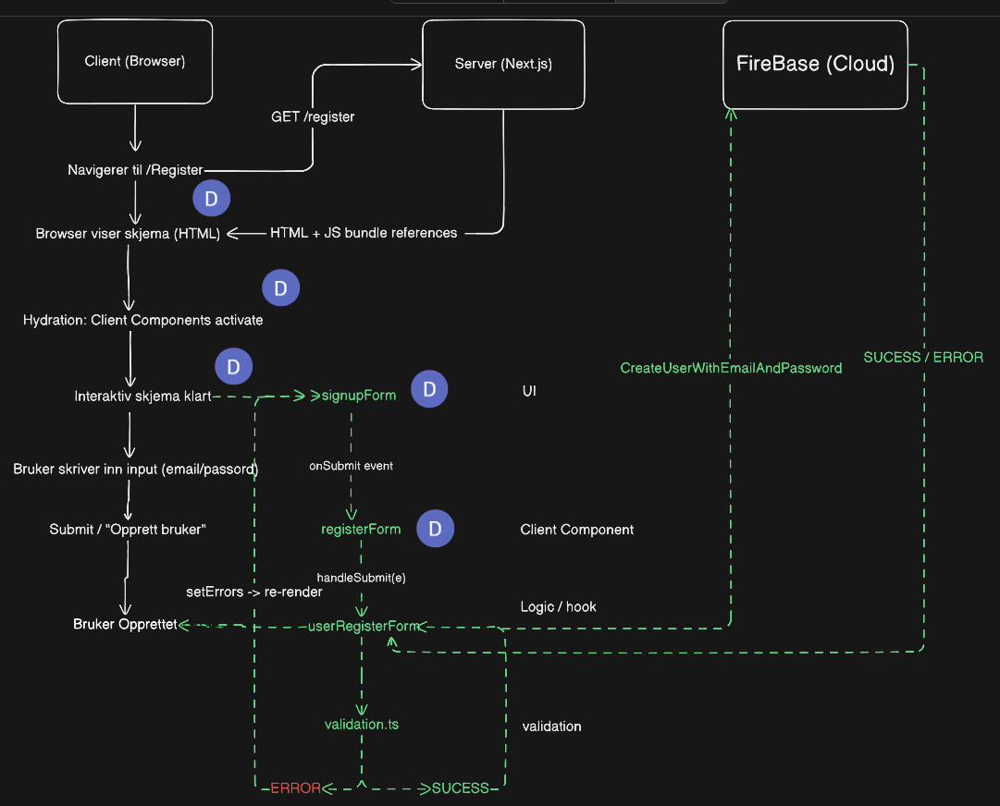

# Authentication

Kort oversikt over hvordan autentisering fungerer i prosjektet, og hvordan den brukes i kodebasen.

## Hva auth brukes til

- Vise riktig UI for innlogget/utlogget bruker.
- Beskytte sider som krever innlogging.
- Logge inn, registrere og logge ut via Firebase Authentication.

## Viktige filer

- Auth state-hook: [`useAuth.ts`](../../../utleiometer/src/features/auth/hooks/useAuth.ts)
- Beskyttede ruter: [`(protected)/layout.tsx`](../../../utleiometer/src/app/%28protected%29/layout.tsx)
- Login-side: [`(auth)/login/page.tsx`](../../../utleiometer/src/app/%28auth%29/login/page.tsx)
- Register-side: [`(auth)/register/page.tsx`](../../../utleiometer/src/app/%28auth%29/register/page.tsx)
- Login-logikk: [`useLoginForm.ts`](../../../utleiometer/src/features/auth/hooks/useLoginForm.ts)
- Register-logikk: [`useRegisterForm.ts`](../../../utleiometer/src/features/auth/hooks/useRegisterForm.ts)
- Auth-knapper i header: [`authButtons.tsx`](../../../utleiometer/src/features/auth/client-components/authButtons.tsx)
- Logout-knapp: [`logoutButton.tsx`](../../../utleiometer/src/features/auth/client-components/logoutButton.tsx)
- Firebase klientoppsett: [`client.ts`](../../../utleiometer/src/lib/firebase/client.ts)

## Hvordan det fungerer

1. `useAuth` lytter på Firebase `onAuthStateChanged` og gir `currentUser` + `loading`.
2. `AuthButtons` bruker `useAuth` for å vise enten login/register eller logout.
3. Alle sider under `src/app/(protected)` går gjennom `ProtectedLayout`.
4. Hvis bruker ikke er innlogget, sendes brukeren til `/login?next=...` med `router.replace(...)`.
5. Login/register hooks gjør Firebase-kall og navigerer til `/` ved suksess.

## Hvordan vet appen om brukeren er pålogget hele tiden?

I [`useAuth.ts`](../../../utleiometer/src/features/auth/hooks/useAuth.ts) brukes en `useEffect` til å registrere Firebase-listeneren `onAuthStateChanged`.
Denne effekten kjører når hooken mountes, og listeneren varsler hver gang auth-status endrer seg (login/logout/session restore).

- Hvis bruker er innlogget: `currentUser` settes til brukerobjekt.
- Hvis bruker ikke er innlogget: `currentUser` blir `null`.
- Mens dette sjekkes: `loading` er `true`, så UI kan vente før det viser auth-avhengig innhold.
- `useEffect` returnerer også en cleanup (`unsubscribe`) når komponent unmountes.

Dette er grunnen til at appen «alltid vet» om brukeren er innlogget eller ikke, uten at man manuelt må oppdatere sider.

## Hvordan teamet bruker auth i praksis

- I klientkomponenter: importer `useAuth()` og sjekk `currentUser` før handlinger.
- For sider som må være private: legg dem under `src/app/(protected)/...`.
- For vanlig navigering: bruk `Link`; for navigering etter handling (f.eks. login), bruk `router.push`.

## Rask eksempel-flyt

- Uinnlogget bruker åpner `/properties/new`.
- `ProtectedLayout` oppdager manglende bruker og redirecter til `/login?next=...`.
- Bruker logger inn via `useLoginForm`.
- Etter vellykket login sendes bruker til `/`.